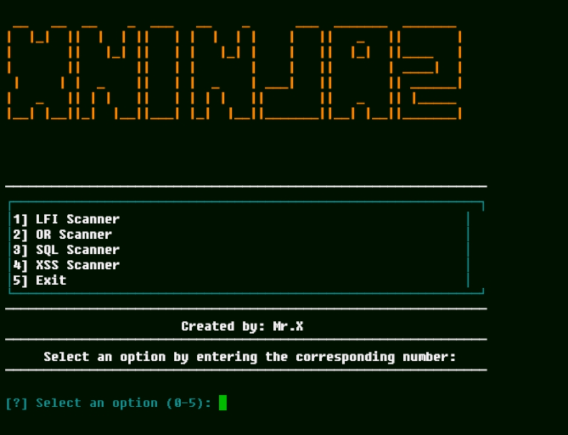

# Xninjaz


## introduction
Xninjaz is a powerful and versatile multi-vulnerability scanner designed to detect various web application vulnerabilities, including Local File Inclusion (LFI), Open Redirects (OR), SQL Injection (SQLi), and Cross-Site Scripting (XSS). This tool was created by Mr.X

## Instalations
```
$ pkg update -y && pkg upgrade -y
$ apt update -y && apt upgrade -y
$ pkg install git
$ pkg install python -y
$ git clone https://github.com/Whomrx666/Xninjaz.git
$ cd Xninjaz
$ pip install -r requirements.txt
$ python Xninjaz.py
```
## Features

- **LFI Scanner**: Detect Local File Inclusion vulnerabilities.
- **OR Scanner**: Identify Open Redirect vulnerabilities.
- **SQL Scanner**: Detect SQL Injection vulnerabilities.
- **XSS Scanner**: Identify Cross-Site Scripting vulnerabilities.
- **Multi-threaded scanning**: Improved performance through multi-threading.
- **Customizable payloads**: Adjust payloads to suit specific targets.
- **Success criteria**: Modify success detection criteria for specific use cases.
- **User-friendly command-line interface**: Simple and intuitive.
- **Save vulnerable URLs**: Option to save the results of vulnerable URLs to a file..

## Requirements

- **Python 3.x**
- `webdriver_manager==4.0.2`
- `selenium==4.24.0`
- `aiohttp==3.10.5`
- `beautifulsoup4==4.12.3`
- `colorama==0.4.6`
- `rich==12.6.0`
- `requests==2.28.1`

## Instructions
- **first**: Install tools according to the instructions above
- **second**: Select one of the columns you want to run
- **third**: Enter a custom path or single URL with the vulnerability that matches the column you selected
- **last**: Tools will automatically search for vulnerabilities 

## Input Information:
- **Input URL/File**: You can provide a single URL or an input file containing a list of URLs to scan.
- **Payload File**: Select or provide a custom payload file for the type of vulnerability you want to scan for.
- **Success Criteria:**:  Define the patterns or strings that indicate a successful exploitation attempt.
- **Concurrent Threads:**: Set the number of threads for multi-threaded scanning.
- **View and Save Results:**: Results will be displayed in real-time as the scan progresses.
After the scan completes, you will have the option to save the URLs found to be vulnerable to a file for future reference.

## Customization
Xninjaz allows for various levels of customization to fit your specific testing needs:
- **Custom Payloads:**: Create or modify payload files to suit specific vulnerability types or applications. Payloads should be tailored to the vulnerability being tested.
- **Success Criteria:**: Adjust the success criteria patterns in the tool to identify successful exploitation attempts more accurately. For example, you can modify the tool to check for specific error messages or unique responses.
- **Concurrent Threads:**:  Control the number of concurrent threads used during the scan to optimize performance based on system resources.

## Observation
This is a tool for education only, I am not responsible for any misuse
### Original Author
<a href="https://github.com/Whomrx666"></a>

### <<< If you copy , Then Give me The Credits >>>

## CONNECT WITH ME :

[](https://whomrxhackers.blogspot.com/)
[](https://twitter.com/whomrx666)
[](https://wa.me/6285926601133?text=Halo%2C%20Mr.X)
[](https://www.facebook.com/whomrx.666)
[](https://t.me/Whomr_X)
[](mailto:whomrx666@gmail.com)
[](https://www.tiktok.com/@whomr.x)

**If you want to donate, click on the button**
<a href="https://saweria.co/whomrx"></a>

---

<p align="left">
  
</p>

---